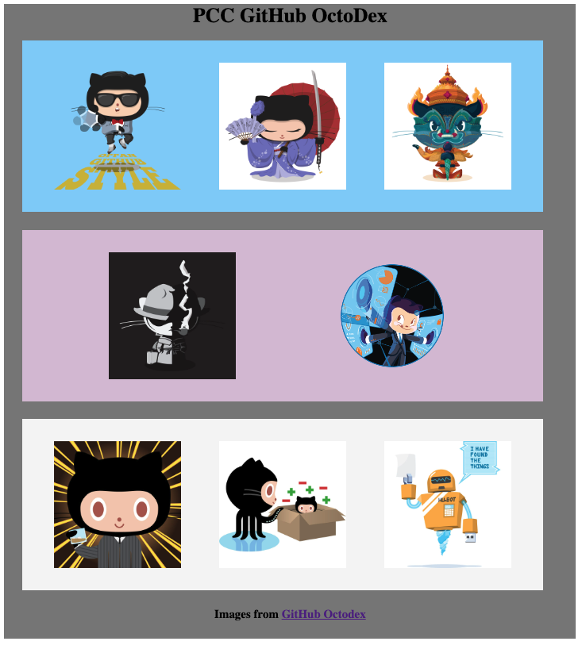

<h1>CSS - ASSIGNMENT 5 - FlexDex </h1>

Consider the following image files & mockup 

<a href="./assets" >Assets folder </a>

Using the skills we just reviewed, recreate your own version of the GitHub OctoDex using FlexBox properties to create the CORE structure of the page. 

